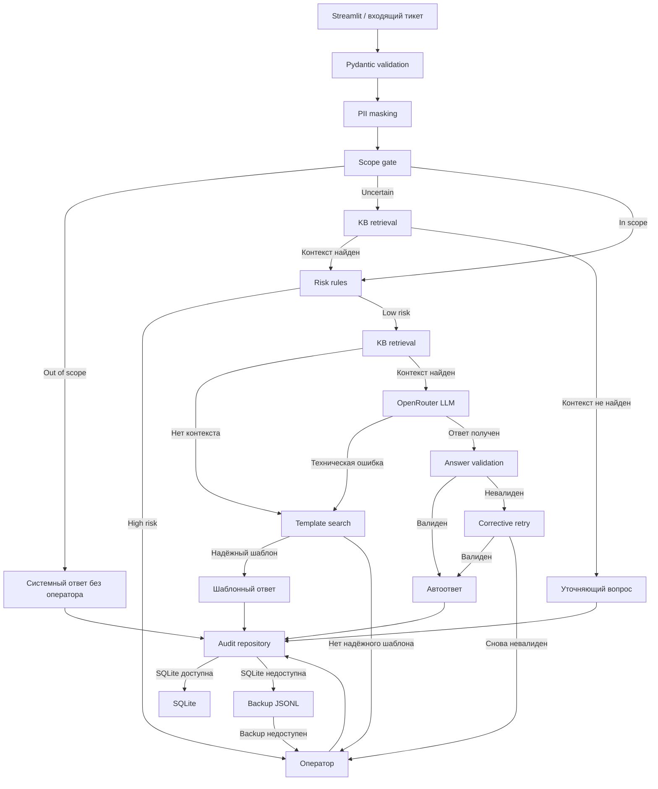

# Support AI PoC

Proof-of-Concept системы автоматизации обработки обращений службы поддержки крупного онлайн-сервиса.

Решение демонстрирует безопасный сквозной сценарий:

```text
сообщение пользователя
→ валидация
→ маскирование PII
→ проверка принадлежности сервису
→ проверка риска
→ поиск в базе знаний
→ генерация ответа через LLM
→ валидация ответа
→ аудит
→ обратная связь пользователя
```

При отказе отдельных компонентов система контролируемо деградирует до проверенного шаблона или передачи обращения оператору.

## Задача

Сервис обрабатывает большой поток обращений из нескольких каналов. Значительная часть вопросов повторяется, но сообщения могут содержать персональные данные, финансовые жалобы, признаки мошенничества и другие рискованные темы.

Цели PoC:

- сократить время первого содержательного ответа;
- снизить нагрузку и стоимость работы операторов;
- не ухудшить CSAT и долю повторно открытых обращений;
- не отправлять необработанные персональные данные во внешний LLM API;
- обеспечить объяснимую маршрутизацию и аудит решений;
- сохранить работоспособность при недоступности LLM или основного хранилища аудита.

## Что реализуется

- Streamlit-интерфейс с чатом и decision trace;
- Pydantic-контракты между компонентами;
- regex-маскирование базовых типов PII;
- проверка принадлежности обращения сервису;
- интерпретируемые high-risk правила;
- локальный semantic retrieval по базе знаний;
- генерация grounded-ответа через OpenRouter;
- строгая валидация JSON, citations и содержимого ответа;
- один corrective retry при невалидном ответе LLM;
- fallback на проверенные шаблоны при технической недоступности LLM;
- передача оператору после исчерпания безопасных автоматических путей;
- SQLite-аудит с резервной записью в JSONL;
- mock-режим и pytest без сетевых вызовов.

## Что не реализуется

PoC не является production-ready системой. В рамках ограничения по времени не реализуются:

- обучение классификатора на размеченных данных;
- полноценный операторский интерфейс;
- автоматическое выполнение действий над аккаунтом или платежами;
- Kafka, Kubernetes, Redis и внешняя PostgreSQL;
- полноценная DLP/NER-система;
- нагрузочное тестирование на реальном масштабе;
- автоматический мониторинг F1/accuracy без ground truth;
- оптимизация порогов на исторической выборке.

## Архитектура



Подробное описание: [docs/architecture.md](docs/architecture.md).

## Основные решения

### Риск и наличие PII разделены

Высокий риск определяется смыслом обращения: взлом, мошенничество, неизвестное списание, юридическая претензия, удаление данных и другие чувствительные сценарии.

High-risk обращение не передаётся в LLM и направляется оператору.

### Нет классификатора «типовой / нетиповой»

Для обучения такого классификатора нет размеченного датасета. Вместо искусственной модели используются:

- semantic retrieval по базе знаний;
- score и margin поиска;
- правила риска;
- metadata документа;
- output guardrails.

### LLM не доверяет собственной уверенности

Право на автоответ определяется не числом `confidence`, возвращённым LLM, а внешними сигналами:

- обращение относится к сервису;
- риск низкий;
- найден релевантный документ;
- документ разрешает автоответ;
- citations существуют в retrieved context;
- ответ прошёл Pydantic и policy validation;
- аудит решения сохранён.

### Graceful degradation

При технической недоступности LLM система ищет релевантный проверенный шаблон. Оператор подключается только при отсутствии надёжного автоматического пути.

При невалидном ответе LLM выполняется один corrective retry. После второй ошибки обращение передаётся оператору.

## Структура репозитория

```text
.
├── app.py
├── demo.py
├── README.md
├── AI_USAGE.md
├── SELF_REVIEW.md
├── WORKLOG.md
├── data/
│   ├── knowledge_base.json
│   ├── response_templates.json
│   ├── service_scope.json
│   └── demo_tickets.json
├── docs/
│   ├── product.md
│   ├── architecture.md
│   ├── ml.md
│   ├── monitoring.md
│   └── risks-and-ops.md
├── runtime/
├── src/
└── tests/
```

## Быстрый запуск

### Linux / macOS

```bash
python -m venv .venv
source .venv/bin/activate
pip install -r requirements.txt
cp .env.example .env
python demo.py
streamlit run app.py
```

### Windows PowerShell

```powershell
python -m venv .venv
.venv\Scripts\Activate.ps1
pip install -r requirements.txt
Copy-Item .env.example .env
python demo.py
streamlit run app.py
```

## OpenRouter

Для реального режима укажите в `.env`:

```env
OPENROUTER_API_KEY=your_key
OPENROUTER_MODEL=your_model
```

Файл `.env` не должен попадать в Git. Без API key приложение должно запускаться в mock-режиме.

## Тесты

```bash
python -m pytest -q
```

Unit-тесты не должны обращаться к интернету или реальному OpenRouter.

Критические сценарии:

- PII маскируются и не вызывают эскалацию сами по себе;
- high-risk запрос не вызывает LLM;
- out-of-scope запрос не передаётся оператору;
- LLM timeout приводит к шаблонному fallback;
- первый невалидный ответ вызывает один retry;
- два невалидных ответа приводят к оператору;
- отказ SQLite приводит к записи в JSONL;
- отказ обоих audit storage блокирует автоответ.

## Демонстрационные сценарии

```bash
python demo.py
```

Рекомендуемые сценарии:

1. Восстановление пароля с email в тексте.
2. Подозрение на взлом аккаунта.
3. Недоступность LLM и ответ по шаблону.
4. Вопрос, не относящийся к сервису.
5. Неоднозначное обращение с уточняющим вопросом.
6. Отказ основной базы аудита.

## Метрики пилота

Основная гипотеза:

> AI-подсказки и безопасные автоответы снижают median handling time минимум на 15%.

Ограничения:

- CSAT ухудшается не более чем на 0,1;
- reopen rate растёт не более чем на 1 процентный пункт;
- небезопасных автоответов — 0;
- подтверждённых утечек PII — 0.

Если эти условия нарушаются, то не стоит выкатывать сервис в прод, а еще поработать над улучшением его архитектуры.

План запуска:

```text
shadow mode → suggest mode → auto-reply для безопасных категорий
```

## Ограничения

- regex не гарантирует обнаружение всех персональных данных;
- keyword rules не гарантируют полный recall рискованных обращений;
- scope и retrieval thresholds заданы экспертно;
- база знаний и шаблоны искусственные и небольшие;
- результаты продуктового эффекта можно получить только в пилоте;
- внешний LLM API остаётся сторонней зависимостью;
- PoC не выполняет реальные операции и не заменяет оператора в рискованных сценариях.

