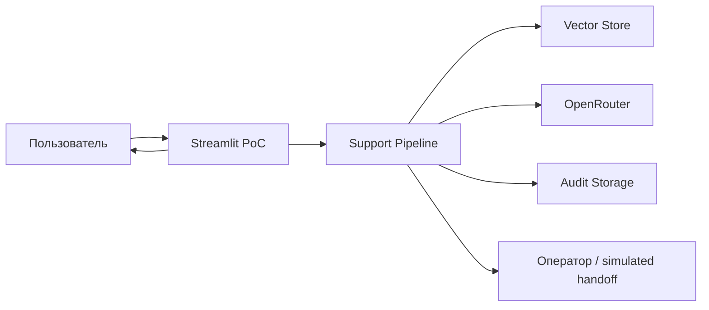
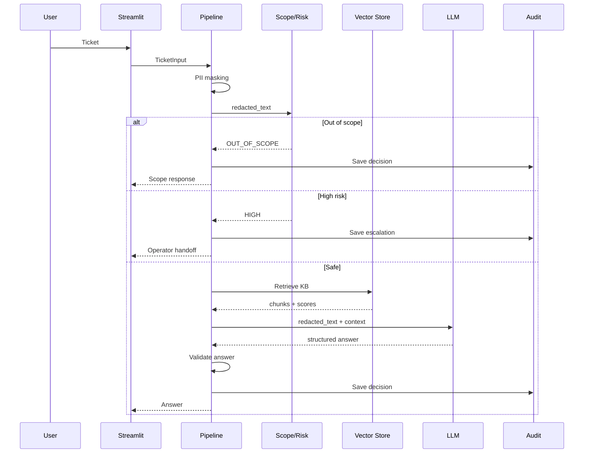
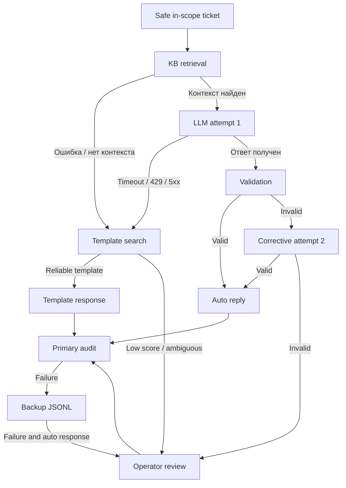
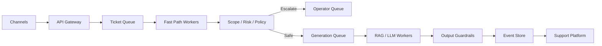

# Архитектура решения

## 1. Архитектурные принципы

1. **Fail safely.** Система не обязана автоматически отвечать на каждый запрос.
2. **PII first.** Маскирование выполняется до retrieval, LLM и технического аудита.
3. **Deterministic orchestration.** Бизнес-переходы задаются кодом, а не автономным агентом.
4. **LLM is not a policy engine.** Модель генерирует текст, но не разрешает себе автоответ.
5. **Grounded generation.** Ответ строится только по retrieved context.
6. **Graceful degradation.** Отказ LLM не означает отказ всей системы.
7. **Auditable decisions.** Маршрут и причины решения сохраняются.
8. **Human-in-the-loop.** Рискованные и сомнительные случаи передаются оператору.

## 2. Контекст системы



## 3. Компоненты

### Streamlit UI

Отвечает только за:

- ввод сообщения;
- отображение истории;
- demo mode;
- decision trace;
- обратную связь «Помогло / Не помогло».

UI не должен содержать бизнес-логику маршрутизации.

### Pydantic schemas

Фиксируют контракты:

- `TicketInput`;
- `PrivacyResult`;
- `ScopeResult`;
- `RiskResult`;
- `RetrievalResult`;
- `LLMAnswer`;
- `ValidationResult`;
- `DecisionRecord`.

`extra="forbid"` снижает риск тихого принятия неожиданной структуры.

### PII service

Обнаруживает и заменяет email, телефон, карту, IP, OTP и токен. Возвращает только обезличенный текст и метаданные о типах PII.

### Scope gate

Определяет `IN_SCOPE`, `OUT_OF_SCOPE` или `UNCERTAIN`.

Явно нерелевантный запрос завершается системным ответом без LLM и оператора.

### Risk service

Использует интерпретируемые правила. High-risk запросы не передаются во внешний LLM.

### Knowledge retriever

Ищет релевантные статьи базы знаний и возвращает top-k, top1 score, top2 score, margin и document metadata.

### Template retriever

Используется как fallback при технической недоступности LLM или retrieval.

Шаблон разрешается только при выполнении policy:

- высокий score;
- достаточный margin;
- `auto_reply_allowed=true`;
- `risk=low`;
- `is_active=true`.

### LLM client

Получает redacted ticket, retrieved chunks и разрешённые document IDs.

Ожидаемый ответ:

```json
{
  "answer": "Текст ответа",
  "citations": ["kb_document_id"],
  "needs_operator": false
}
```

### Answer validator

Проверяет:

- Pydantic schema;
- citations;
- отсутствие PII;
- отсутствие запроса секретов;
- отсутствие обещаний выполненных действий;
- `needs_operator`;
- длину и непустой ответ.

### Audit repository

Primary: SQLite.

Backup: append-only JSONL.

Raw пользовательский текст не сохраняется.

## 4. Основной pipeline



## 5. Fallback-логика



## 6. Corrective retry

Corrective retry выполняется только если LLM технически ответила, но результат не прошёл валидацию.

Второй запрос содержит:

- тот же redacted ticket;
- тот же контекст;
- список ошибок;
- разрешённые citations;
- `temperature=0`.

Количество попыток ограничено двумя.

При техническом outage corrective retry не выполняется — система сразу переходит к шаблонному fallback.

## 7. Аудит

### Что сохраняется

- event ID;
- ticket ID;
- action;
- response source;
- scope;
- risk;
- PII types;
- retrieved document IDs;
- scores;
- LLM attempts и latency;
- fallback reason;
- degradation events;
- audit storage;
- processing latency;
- redacted text, если это разрешено политикой.

### Что не сохраняется

- raw text;
- API key;
- placeholder mapping;
- полный prompt;
- raw LLM response;
- секреты пользователя.

## 8. Состояния тикета

```text
NEW
→ VALIDATED
→ REDACTED
→ SCOPED
→ TRIAGED
→ RETRIEVED
→ GENERATED / TEMPLATE_SELECTED
→ VALIDATED_RESPONSE
→ AUDITED
→ ANSWERED
→ RESOLVED / ESCALATED
```

Для PoC состояния могут быть представлены через итоговый `DecisionRecord`, без полноценной workflow БД.

## 9. Производительность

### PoC

- локальный последовательный pipeline;
- Streamlit;
- Chroma;
- SQLite;
- один пользовательский процесс.

### Целевая архитектура



Fast path должен включать дешёвые операции:

- validation;
- PII preprocessing;
- scope/risk;
- routing.

## 10. Production evolution

До production необходимы:

- managed vector DB или поисковый сервис;
- versioned KB;
- PostgreSQL и durable queue;
- централизованная DLP/NER;
- provider allowlist и Zero Data Retention;
- rate limiting;
- circuit breaker;
- полноценный operator handoff;
- нагрузочное и security-тестирование;
- аудит качества на исторических данных.
